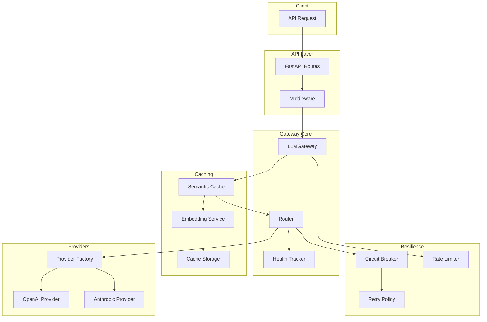
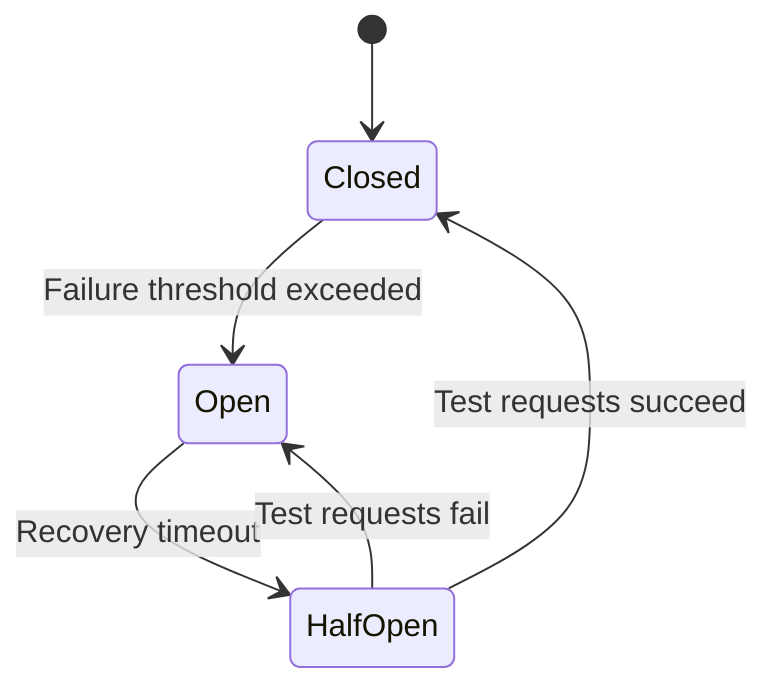

# LLM Gateway Implementation Walkthrough

## Overview

This walkthrough documents the implementation of a **production-grade LLM Gateway** with multi-provider support, intelligent routing, resilience patterns, and semantic caching.

---

## Architecture



---

## Components Implemented

### 1. Provider Layer

| File | Purpose |
|------|---------|
| `providers/base.py` | Abstract base class defining provider contract |
| `providers/models.py` | Provider-agnostic request/response models |
| `providers/openai_provider.py` | OpenAI API integration with tiktoken |
| `providers/anthropic_provider.py` | Anthropic Claude API integration |
| `providers/factory.py` | Factory pattern for provider management |

**Key Features:**
- Unified interface for all LLM providers
- Streaming support with async generators
- Token counting and cost estimation
- Provider capability enumeration

---

### 2. Routing Layer

| File | Purpose |
|------|---------|
| `routing/strategies.py` | 5 routing strategies |
| `routing/health.py` | Provider health tracking |
| `routing/router.py` | Main router orchestration |

**Routing Strategies:**

| Strategy | Description |
|----------|-------------|
| `FallbackChainStrategy` | Tries providers in priority order |
| `RoundRobinStrategy` | Distributes requests evenly |
| `CostBasedStrategy` | Selects cheapest provider |
| `LatencyBasedStrategy` | Selects fastest provider |
| `WeightedRandomStrategy` | Random selection with performance weights |

---

### 3. Resilience Layer

| File | Purpose |
|------|---------|
| `resilience/circuit_breaker.py` | Circuit breaker pattern |
| `resilience/retry.py` | Retry with exponential backoff |
| `resilience/rate_limiter.py` | Token bucket & sliding window |

**Circuit Breaker States:**



---

### 4. Caching Layer

| File | Purpose |
|------|---------|
| `cache/storage.py` | Cache storage with LRU eviction |
| `cache/embeddings.py` | Embedding generation service |
| `cache/semantic_cache.py` | Semantic similarity matching |

**How Semantic Caching Works:**
1. Generate embedding for the request content
2. Search cache for similar embeddings (cosine similarity)
3. Return cached response if similarity exceeds threshold
4. Otherwise, call provider and cache the response

---

### 5. API Layer

| File | Purpose |
|------|---------|
| `api/routes.py` | FastAPI route definitions |
| `api/schemas.py` | Request/response Pydantic schemas |
| `api/middleware.py` | Logging, correlation ID, error handling |

**API Endpoints:**

| Method | Endpoint | Description |
|--------|----------|-------------|
| POST | `/v1/completions` | Create a completion |
| POST | `/v1/completions/stream` | Streaming completion (SSE) |
| GET | `/v1/providers` | List providers |
| GET | `/v1/providers/{id}/health` | Provider health check |
| GET | `/v1/cache/stats` | Cache statistics |
| DELETE | `/v1/cache` | Clear cache |
| GET | `/health` | Gateway health check |

---

### 6. Gateway Orchestrator

| File | Purpose |
|------|---------|
| `gateway.py` | Main gateway coordinating all components |
| `main.py` | FastAPI application entry point |

---

## Usage Examples

### Basic Completion

```python
from llm_gateway import LLMGateway, CompletionRequest, Message, MessageRole

# Initialize gateway
gateway = LLMGateway()

# Create request
request = CompletionRequest(
    messages=[
        Message(role=MessageRole.USER, content="What is the capital of France?")
    ],
    temperature=0.7,
    max_tokens=100,
)

# Get completion
response = await gateway.complete(request)
print(response.content)
```

### With Routing Preferences

```python
from llm_gateway.providers.models import RoutingHints

request = CompletionRequest(
    messages=[Message(role=MessageRole.USER, content="Hello!")],
    routing=RoutingHints(
        strategy="cost",  # Use cheapest provider
        preferred_providers=["anthropic"],  # Prefer Anthropic
        exclude_providers=["openai"],  # Exclude OpenAI
    ),
)
```

### Streaming Response

```python
async for chunk in gateway.stream(request):
    print(chunk.content, end="", flush=True)
```

### API Request (curl)

```bash
curl -X POST http://localhost:8000/v1/completions \
  -H "Content-Type: application/json" \
  -d '{
    "messages": [{"role": "user", "content": "Hello!"}],
    "temperature": 0.7,
    "max_tokens": 100
  }'
```

---

## Configuration

Environment variables (see `.env.example`):

| Variable | Description | Default |
|----------|-------------|---------|
| `OPENAI_API_KEY` | OpenAI API key | - |
| `ANTHROPIC_API_KEY` | Anthropic API key | - |
| `DEFAULT_ROUTING_STRATEGY` | Default routing strategy | `fallback` |
| `RATE_LIMIT_ENABLED` | Enable rate limiting | `true` |
| `CACHE_ENABLED` | Enable semantic caching | `true` |

---

## Tests

Comprehensive test suite:

| Test File | Coverage |
|-----------|----------|
| `tests/test_routing.py` | Routing strategies |
| `tests/test_resilience.py` | Circuit breaker, retry, rate limiting |
| `tests/test_cache.py` | Semantic cache, storage |
| `tests/test_gateway.py` | Gateway integration |

### Running Tests

```bash
cd llm-gateway
make install  # Install dependencies
make test     # Run tests
```

### Docker Setup

```bash
cd llm-gateway
make docker-up  # Start with Docker Compose
```

---

## Project Structure

```
llm-gateway/
├── src/llm_gateway/
│   ├── __init__.py         # Package exports
│   ├── config.py           # Configuration management
│   ├── gateway.py          # Main orchestrator
│   ├── main.py             # FastAPI app
│   ├── api/                # API layer
│   │   ├── routes.py
│   │   ├── schemas.py
│   │   └── middleware.py
│   ├── cache/              # Caching layer
│   │   ├── storage.py
│   │   ├── embeddings.py
│   │   └── semantic_cache.py
│   ├── providers/          # Provider implementations
│   │   ├── base.py
│   │   ├── models.py
│   │   ├── openai_provider.py
│   │   ├── anthropic_provider.py
│   │   └── factory.py
│   ├── resilience/         # Resilience patterns
│   │   ├── circuit_breaker.py
│   │   ├── retry.py
│   │   └── rate_limiter.py
│   └── routing/            # Routing layer
│       ├── strategies.py
│       ├── health.py
│       └── router.py
├── tests/                  # Test suite
├── pyproject.toml          # Package configuration
├── Makefile                # Development commands
├── Dockerfile              # Container image
├── docker-compose.yml      # Local development
└── README.md               # Documentation
```

---

## Summary

The LLM Gateway module is now complete with:

- **Multi-provider support** - OpenAI and Anthropic with extensible factory
- **5 routing strategies** - Fallback, round-robin, cost, latency, weighted
- **Resilience patterns** - Circuit breaker, retry with backoff, rate limiting
- **Semantic caching** - Embedding-based similarity matching
- **Production API** - FastAPI with streaming, health checks, documentation
- **Comprehensive tests** - Unit and integration test coverage
